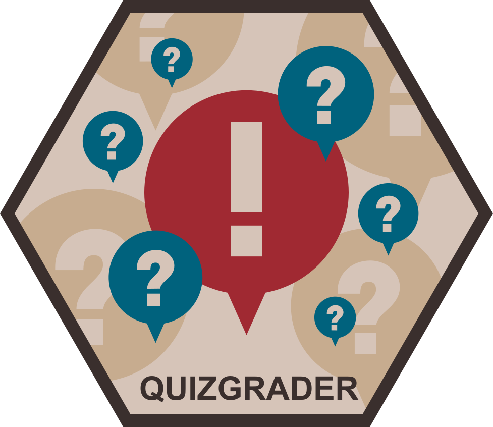

<!-- README.md is generated from README.Rmd. Please edit that file -->

```{r, echo = FALSE}
knitr::opts_chunk$set(
  collapse = TRUE,
  comment = "#>",
  fig.path = "man/figures/"
)
```


```{r setup, include = FALSE}
pkg = 'quizgrader' #so we can easily switch names
library(pkg, character.only = TRUE)
```


# quizgrader 


<!-- badges: start -->
[](https://github.com/andreashandel/quizgrader/actions)
[](https://codecov.io/gh/andreashandel/quizgrader)
[](https://github.com/andreashandel/quizgrader/actions)
[](https://github.com/andreashandel/modeldiagram/actions)
<!-- badges: end -->


## Description
`r pkg` is a package for managing and administering auto-graded online quizzes. 


## Getting Started

For a quick introduction and overview of the package, [see the _Introduction_ tutorial (vignette)](./articles/A_introduction.html).


## Contributing to the package
The package is on GitHub and you can use the usual GitHub process to file bug reports, send feature requests, contribute updates and bug fixes, etc. If you have any comments or feedback, I very much welcome them. Please file a [GitHub issue](https://github.com/andreashandel/quizgrader/issues) and let me know what you think.

## Citation and Contributors

This R package was developed by []() and [Andreas Handel](https://www.andreashandel.com/). It is maintained Andreas Handel. A full list of contributors and a Bibtex entry for the citation [can be found here](https://andreashandel.github.io/quizgrader/authors.html).

This project was/is partially supported by. 


## Further information
 

